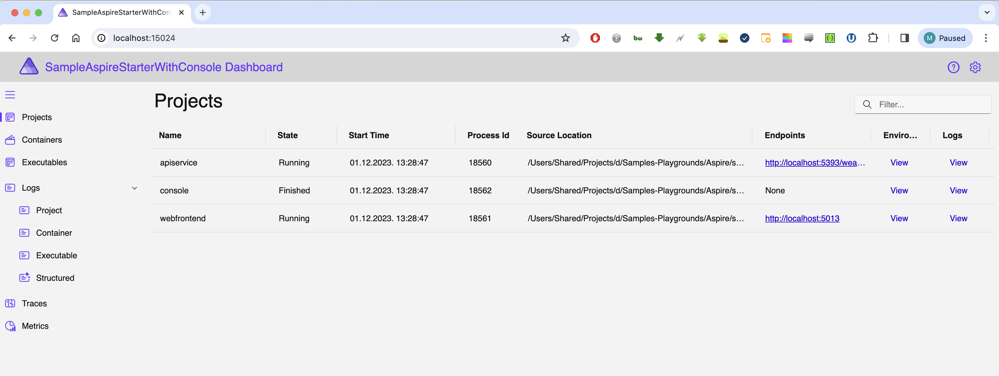
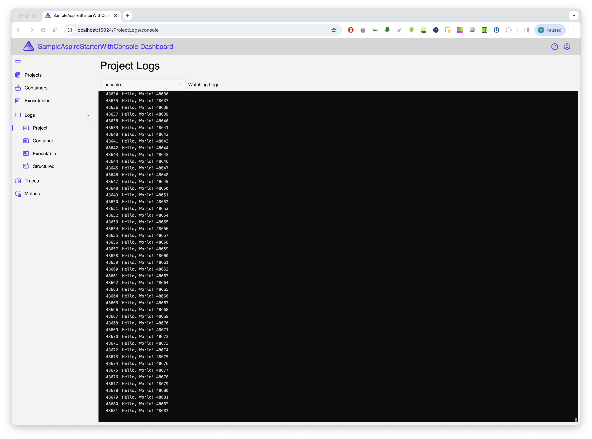

# Aspire with simple client Console

readme.md

## Usage

```bash
dotnet run \
  --project SampleAspireStarterWithConsole.AppHost/SampleAspireStarterWithConsole.AppHost.csproj
```

```pwsh
dotnet run `
  --project SampleAspireStarterWithConsole.AppHost/SampleAspireStarterWithConsole.AppHost.csproj
```







## Notes

```
ll SampleAspireStarterWithConsole.AppHost/obj/Debug/net8.0/Aspire/
```

```
ll SampleAspireStarterWithConsole.AppHost/obj/Debug/net8.0/Aspire/references 
```

```
drwxr-xr-x@ 6 user  staff   192 Dec  1 11:45 .
drwxr-xr-x@ 4 user  staff   128 Dec  1 11:48 ..
-rw-r--r--@ 1 user  staff   988 Dec  1 11:45 AppConsole.ServiceMetadata.g.cs
-rw-r--r--@ 1 user  staff  1328 Dec  1 11:41 SampleAspireStarterWithConsole.ApiService.ServiceMetadata.g.cs
-rw-r--r--@ 1 user  staff  1388 Dec  1 11:41 SampleAspireStarterWithConsole.ServiceDefaults.ServiceMetadata.g.cs
-rw-r--r--@ 1 user  staff  1244 Dec  1 11:41 SampleAspireStarterWithConsole.Web.ServiceMetadata.g.cs
Aspire
```

So there it is!!! Generated code...

```
using System;

namespace Projects;

public class SampleAspireStarterWithConsole_Web : IServiceMetadata
{
  public string AssemblyName => """SampleAspireStarterWithConsole.Web""";
  public string AssemblyPath => """/Users/Shared/Projects/d/Samples-Playgrounds/Aspire/samples/SampleAspireStarterWithConsole/SampleAspireStarterWithConsole.Web/obj/Debug/net8.0/ref/SampleAspireStarterWithConsole.Web.dll""";
  public string ProjectPath => """/Users/Shared/Projects/d/Samples-Playgrounds/Aspire/samples/SampleAspireStarterWithConsole/SampleAspireStarterWithConsole.Web/SampleAspireStarterWithConsole.Web.csproj""";
}
```


```
using System;

namespace Projects;

public class AppConsole : IServiceMetadata
{
  public string AssemblyName => """AppConsole""";
  public string AssemblyPath => """/Users/Shared/Projects/d/Samples-Playgrounds/Aspire/samples/SampleAspireStarterWithConsole/Clients/AppConsole/obj/Debug/net8.0/ref/AppConsole.dll""";
  public string ProjectPath => """/Users/Shared/Projects/d/Samples-Playgrounds/Aspire/samples/SampleAspireStarterWithConsole/Clients/AppConsole/AppConsole.csproj""";
}
```

TODO: ask about project with the same name in different folders!?!?! Kaboooom?!?! Or not?


https://dfederm.com/building-a-console-app-with-.net-generic-host/

https://stackoverflow.com/questions/57992886/di-of-httpclientfactory-in-a-backgroundservice-for-a-console-app

https://learn.microsoft.com/en-us/dotnet/architecture/microservices/implement-resilient-applications/use-httpclientfactory-to-implement-resilient-http-requests

https://stackoverflow.com/questions/52622586/can-i-use-httpclientfactory-in-a-net-core-app-which-is-not-asp-net-core

https://stackoverflow.com/questions/62499092/asp-core-ihostedservice-and-ihttpclientfactory-best-way


https://learn.microsoft.com/en-us/aspnet/core/fundamentals/http-requests?view=aspnetcore-8.0
