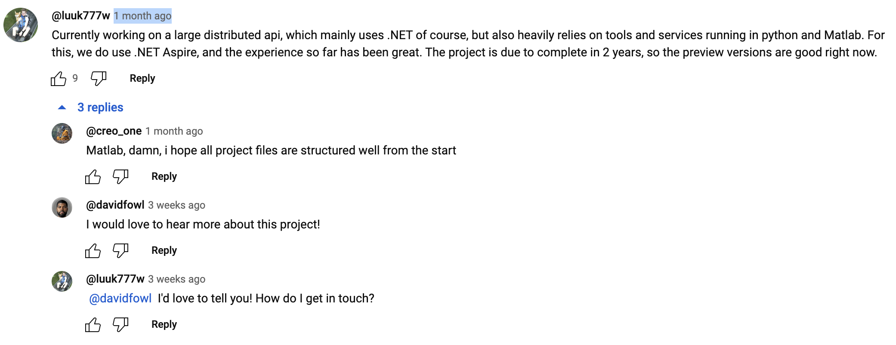
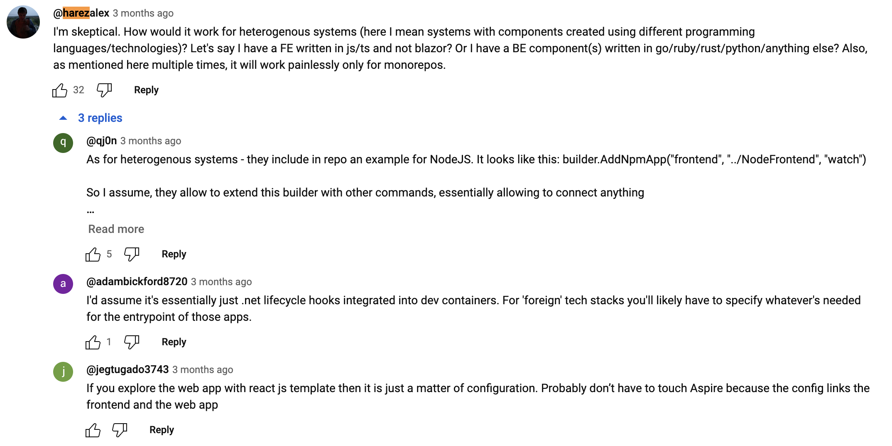

# Aspire with Data Science, Artificial Intelligence and Machine Learning Tools

Context:

*   some users have heterogenous systems

    > Let's say I have a FE written in js/ts and not blazor?

    > Or I have a BE component(s) written in go/ruby/rust/python/anything else?

This is PoC that:

*   Aspire will not fail

*   Building support (components) is not THAT biggy

*   adds 

    *   support for DS/AI/ML tools/languages:

        1.  Python

            2.  scripting
            
            *   web frameworks

                *   Django

                *   Flask

        2.  Matlab/Octave

        3.  Julia

        4.  R

    *   demoes/showcases 
    
        *   samples for DS/AI/ML tools/languages above

        *   non Microsoft Aspire Components (without prefix)

            criticism

            https://www.youtube.com/watch?v=2L68EldtKFo&t=461s&ab_channel=NickChapsas

*   concepts

    *    minimally invasive

    *   try not to add another levels (containers)

        *   easier debugging

## Motivation

Tons of people in DS/AI/ML 

### User constructive with use case

*   Why .NET's Most Ambitious Feature Might Fail

    *   https://www.youtube.com/watch?v=2L68EldtKFo&t=129s&ab_channel=NickChapsas

https://youtu.be/oDSW0t_x9MM

### User skeptical with use case

*   What Is .NET Aspire? The Insane Future of .NET!

    *   https://www.youtube.com/watch?v=DORZA_S7f9w&ab_channel=NickChapsas

## TODOS

*   add OTLP

    *   where possible

    *   where not too much effort

    *   preliminary recon:

        *   python

*   investigate Service Discovery SD

## R&D

*   questions

    1.  console logs are not streamed to dashboard?!?!?!

        julia. Seems like console print is not flushed

    2.  